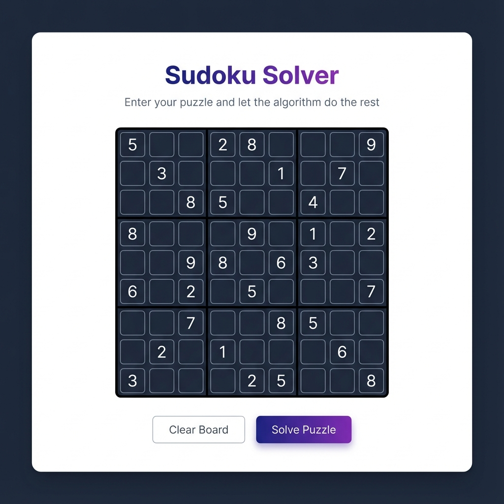
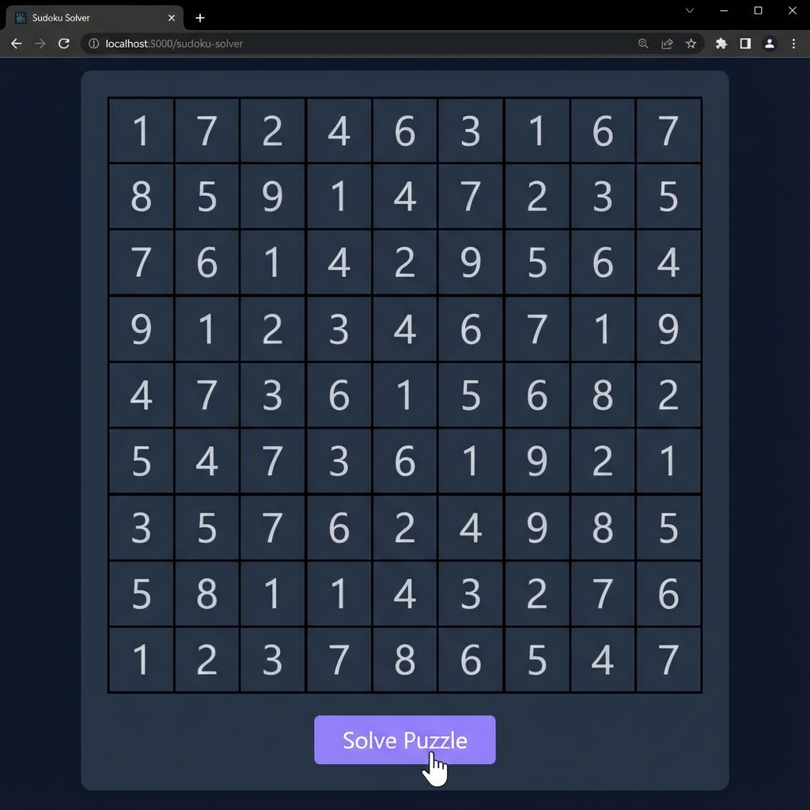
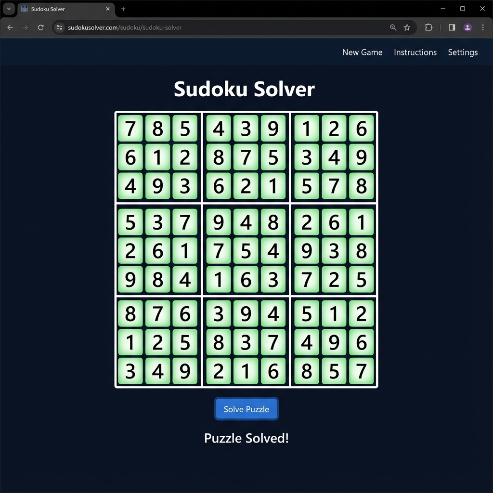

# Sudoku Solver Web App

A modern, premium Sudoku Solver built with Python and Django.



## Demo
| Step 1: Input | Step 2: Solve | Step 3: Result |
|:---:|:---:|:---:|
|  |  |  |


## Overview
This application provides a sleek, dark-themed interface for solving Sudoku puzzles. It uses a backtracking algorithm to find the solution for any valid Sudoku grid instantly.

## Features
- **Smart Solver**: Uses an efficient backtracking algorithm to solve 9x9 puzzles.
- **Premium UI**: Designed with a modern aesthetic, featuring dark mode, transparent gradients, and smooth interactions.
- **Instant Feedback**: Enter your numbers and click "Solve" to see the result immediately.

## How it Works
1. **Frontend**: The user interface is built with HTML5 and CSS3, utilizing Flexbox for the grid layout and modern CSS variables for theming.
2. **Backend**: The core logic is powered by Python. The Django framework handles the HTTP requests.
3. **Algorithm**:
   - The solver finds an empty cell (represented by 0).
   - It attempts numbers 1-9.
   - It checks validity against row, column, and 3x3 box constraints.
   - If a number is valid, it places it and recurses.
   - If the recursion fails (backtracks), it resets the cell to 0 and tries the next number.

## Installation & Running

### Prerequisites
- Python 3.x
- pip

### Steps
1. Clone the repository:
   ```bash
   git clone https://github.com/bdchang403/Soduku_Solver.git
   ```
2. Install dependencies:
   ```bash
   pip install -r requirements.txt
   ```
3. Run the server:
   ```bash
   python manage.py runserver
   ```
4. Open your browser at `http://127.0.0.1:8000/`.

## Deployment

### Docker
The project includes a `Dockerfile` for easy containerization.
```bash
docker build -t sudoku-solver .
docker run -p 8080:8080 sudoku-solver
```

### Google Cloud Run
1. Authenticate with gcloud: `gcloud auth login`
2. Deploy:
   ```bash
   gcloud run deploy sudoku-solver --source . --region us-central1 --allow-unauthenticated
   ```
